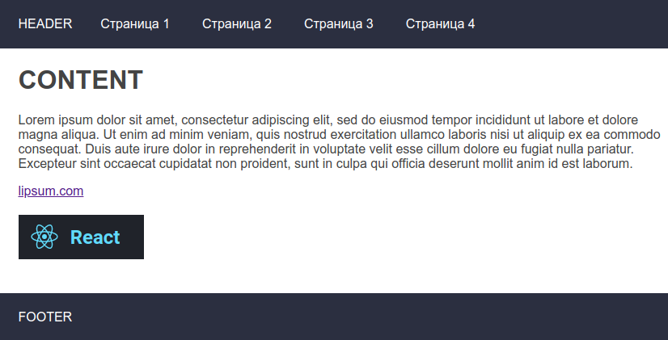
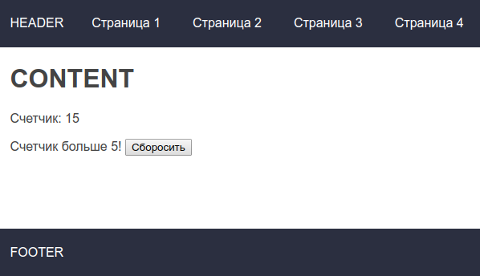
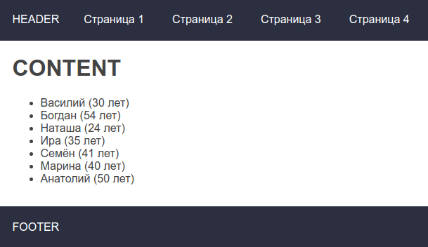

# Задание 1 

Создание простого web приложения с помощью React, webpack и babel.

**Рекомендации:**  
- Прочитать раздел "Основные понятия" с сайта [ru.reactjs.org](https://ru.reactjs.org), пункты `2`,`3`,`4`
- Для запуска сайта использовать программу [node-static](https://www.npmjs.com/package/node-static#command-line-interface), которая при обращении по url отдает в ответ соответствующий файл.  

В команде `npm install -g node-static` есть параметр `-g` означающий, что библиотека 
будет установлена "глобально" в системе, т.е. можно написать в консоли слово `static` в любой папке,
запустив сервер который будет по запросу загружать в браузер файл из этой папки.   
По умолчанию на запрос `http://127.0.0.1:8080` отдаст `index.html`  
На запрос `http://127.0.0.1:8080/page2.html` отдаст `page2.html`  

**Задание:**  
Создать 3 страницы `index.html`, `page2.html`, `page3.html`

**Общий шаблон:**  
Каждая страница это маленькое react приложение, переход между страницами - обычный переход по ссылке на другой html файл
Ссылки в header можно сделать просто тегом "а" 
```
+-----------------------+
| HEADER стр1 стр2 стр3 |
+-----------------------+
|                       |
| CONTENT               |
|                       |
+-----------------------+
| FOOTER                | 
+-----------------------+
```

### Страница "1"  
Разместить на странице html элементы  

`h1` заголовок  
`p` текст  
`a` ccылка на внешний сайт  
`img` картика  
`a img` картинка-ссылка на внешний сайт  

**Ожидаемый результат:**  


### Страница "2"   
Сделать таймер с помощью `setInterval`, который прибавляет +1 каждые 1000мс к переменной, которая в начале равна 0 и выводит эту переменную на экран  
Стоит прочитать про уничножение таймера в жизненном цикле компонента React `componentWillUnmount`, см док по react  
Написать условие, если `таймер > X`, то показать сообщение на странице `Таймер больше Х`  

**Ожидаемый результат:**  


### Страница "3"  
Создать на js переменную-массив, например  `[{name:'А',age:1},{name:'Б',age:2},{name:'Ц',age:3}]`  
Вывести в разметку используя `map()`  

**Ожидаемый результат:**  


**Рекомендации:**  
Чтобы собрать сразу все три приложения, используя единственный webpack конфиг, в `webpack.confing.js` можно написать 3 входные точки, получится 3 скрипта, по одному на каждую страницу.  
```
entry: {
    script1: "./index.js",
    script2: "./page2.js",
    script3: "./page3.js"
},
output: {
    filename: '[name].js',
    ...
}
```

### Пример решения задачи
В примере есть страница 4, предлагающее альтернативое решение третьей задачи   
[/stage1/example](/stage1/example/readme.md) 