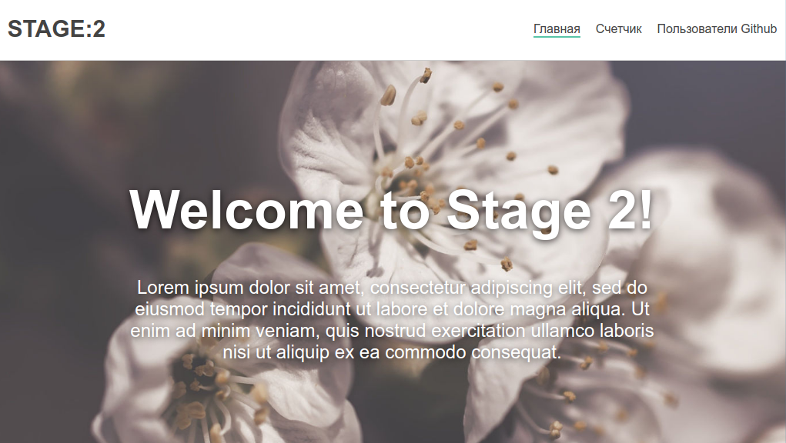

# Задание 2

Изучение клиентского роутинга.  

**Рекомендации:**  
- Прочитать раздел "Основные понятия" с сайта [ru.reactjs.org](https://ru.reactjs.org), пункты `5`,`6`,`7`
- На сайте [@reach/router](https://reach.tech/router) посмотреть в разделе Tutorial пункты `Router`, `Url Parameters`
- Нужно будет воспрользоваться компонентами `<Router/>` `<Page1 path="/page1" />` `<Link to="/page1" />`  

**Задание:**  
Создать React приложение из 3 страниц с помощью клиентского роутера   

**Общий шаблон:**   
Сделать меню с логотипом и предусмотреть контейнер `<div>{this.props.children}</div>` куда будет ренедриться содержимое "страницы"

```
-----------------------
|Бренд стр1 стр2 стр3 |
-----------------------
|      CONTENT        |
|                     |
-----------------------
```


### Страница "Главная":
Должна быть доступна по ссылке `"/"`  
Представляет из себя компонент "джумботрон".    
Разместить картинку с лозунгом. Картинка и текст, естественно, любые, на картинке просто типичный образец.    

**Обратить внимание:**
- Активная ссылка выделена, всего 3 ссылки  
- Логотип слева, можно просто текстовый  
- Меню справо  
- Лозунг по центру крупнее, жирнее
- Текст под лозунгом попробовать сделать тонким
- Пока все делать с расчетом на фиксированную ширину экрана ~1200px

**Ожидаемый результат:**


### Страница "Счетчик":
Должна быть доступна по ссылке `"/counter"`  
Разместим счетчик из первого задания или сделать новый.  
Бесконечный счетчик, используя setInterval, без цикла с периодом 1000мс    
Выводить текущее значение на экран, например `<div>300</div>`  
Когда счетчик превысит пороговое значение Х вывести под ним текст `<div>Счетчик больше Х</div>`  
Сделать кнопку сброса счетчика на ноль.  

**Обратить внимание:**  
- Прочитать про жизненный цикл (ЖЦ) компонента, можно на каждом этапе выводить в консоль текст с именем этапа ЖЦ
- Создавать счетчик в "монтаже" компонента, удать при "демонтаже"
- Попробовать не удалять, посмотреть какой будет эффект 
- Предусмотреть, что сброс может быть после того, как появился текст "Счетчик больше Х"

**Ожидаемый результат:**

### Страница "Пользователи Github":
Должна быть доступна по ссылке `"/users"`  
Вывести на экран пользователей гитхаба из файла `users.js`, взято отсюда [Github api docs](https://developer.github.com/v3/users/#get-all-users)  
Сделать возможность использования параметра, записываемого пока в ручную в url `"/users?id=37"`  
Прочитать параметр из URL средствами reach-router и использовать для фильтрации списка по точному совпадению с идентификатором пользователя (поле id)  
Сделать `<input type="text">` и использовать текст из инпута для фильтрации списка по частичному совпадению с логином пользователя (поле login)  

**Обратить внимание:** 
- Аватары большие, при выводе на страницу сделать поменьше средствами css 
- Попробовать выводить по 3 картинки в один ряд и не подгоном ширины под автоперенос, а поискать способы как это делать "надежно".
- Прочитать как управлять элементами типа input (при изменении текста используется state)
- При вводе каждой\следующей буквы в input список пользователей будет сразу меняться, чтобы удовлетворять фильтру
- Можно поменять в списке пользователей текст в поле login, чтобы фильтр интересней работал 

**Ожидаемый результат:**


