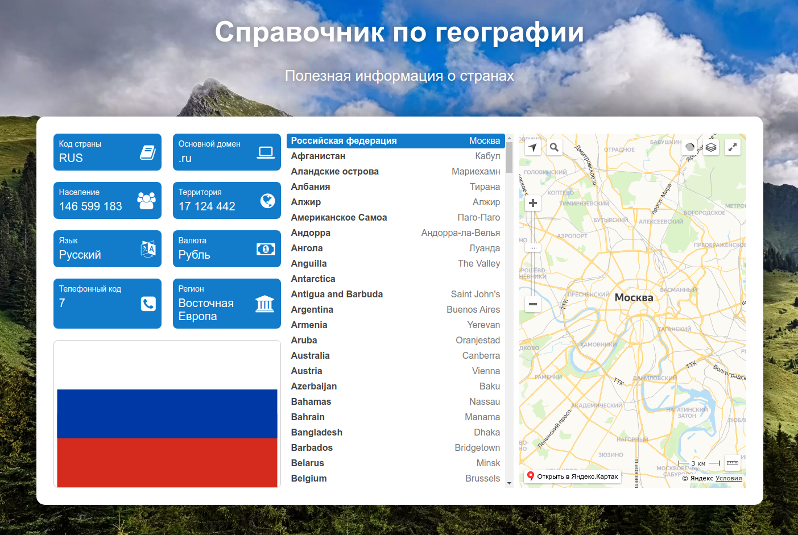

### Задание 3

Создадим страницу, которая показывает информацию по разным странам с картой и иконками.   
Данные лежат в файле `countries.js` (взято с сайта [restcountries.eu](https://restcountries.eu))  

**Структура такая**
```
-----------------------
|  Джумботрон         |
-----------------------
|Инфа | Список |Карта |
|     | стран  |      |
|     |        |      |
|Флаг |        |      |
-----------------------
```

Блоки левый, центральный и правый лучше сделать отдельными React-компонентами

**Раздел "Инфа":**  
Выводим какие-нибудь данные из `countries.js`, 
сопровождаем лейблом с описанием, что за данные и иконкой Awesome  

**Раздел "Флаг":**  
`countries.js` содержит ссылки на svg файл, флаг вывести на экран. 
Учесть, что соотношение сторон у флагов не фиксированное, размер по умолчанию довольно большой, порядка 1000+px
Использовать [awesome](https://fontawesome.com/v4.7.0/icons/) иконки, это шрифт, где каждая буква - векторное изображение.  
Для установки шрифта для начала сходить по простейшему пути - запросить ссылку на CDN со шрифтом на свою почту, нажав `Send my Font Awesome embed code!` [тут](https://fontawesome.com/v4.7.0/get-started)  
Далее подключить скрипт и в нужном месте написать `<i class="fa fa-anchor"></i>`

**Раздел "Список стран":**  
Список длинный, использовать ограничение по высоте и сделать скролл-бар, чтобы список можно было прокручивать
В строчку списка можно нажимать и выбирать страну.
Сделать выделение текущего\выбранного пункта
Выделение делается навешиванием класса на нужную строчку
Скролл делается css свойством overflow + фиксированная высота

**Раздел "Карта"**  
Вывести карту (например Яндекс карту), сфокусировать ее на координатах, которые можно взять 
в `countries.js` в поле `latlng`. В некоторых строках есть координаты столицы `countries[0].capital.latlng`
Во всех есть координаты центра страны `countries[0].latlng`  
Для установки яндекс карты воспользоваться [инструкцией](https://tech.yandex.ru/maps/jsapi/doc/2.1/quick-start/index-docpage)  
Экземпляр карты использует 2 аргумента {center,zoom}.   
center - координаты latlng  
zoom - масштаб, для города можно использовать число 11, для страны 6  
Координаты столиц можно [тут посмотреть](https://time-in.ru/coordinates)  
[Сайт](https://yandex.ru/map-constructor/location-tool), чтобы самостоятельно определить координаты
###Ожидаемый результат

