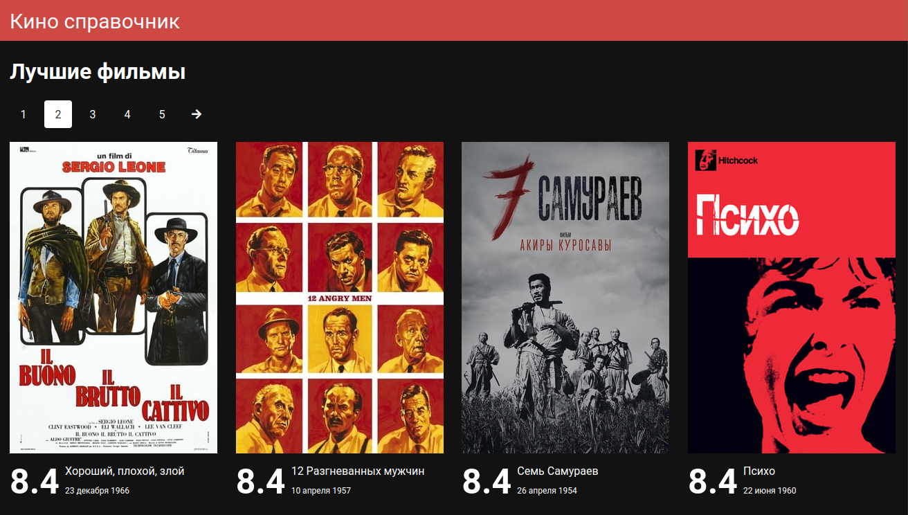
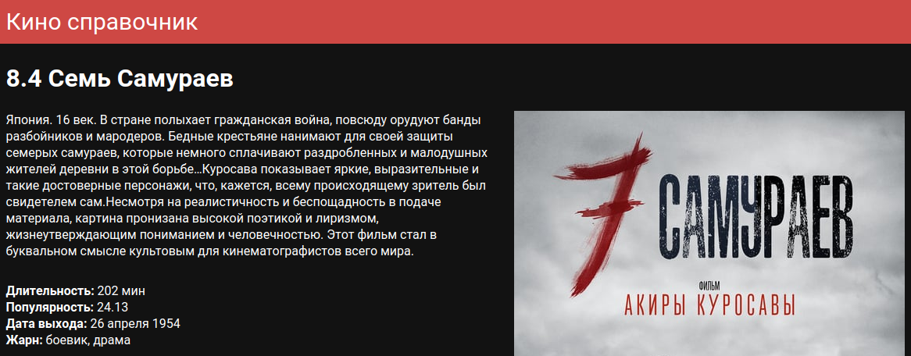

### Задание 4

Изучение xhr, на примере вызовов api сервера публичной БД в фильмами [TMDB](https://www.themoviedb.org)

Для вызовов api БД нужен ключ, параметр `api_key` в каждом запросе, который можно получить 
зарегистрировавшись на TMDB, после в личном кабинете зайти в раздел API и попросить ключ.  

Что такое XHR можно прочитат на [learn.javascript](https://learn.javascript.ru/ajax-xmlhttprequest)
Для программирования вызовов лучше использовать библиотеку [axios](https://github.com/axios/axios)

**Страница "Лучшие фильмы":**  
Должна быть доступна по ссылке `"/"`  
Показывает список лучших фильмов с пейджером `[<-] [1] [2] [3] [4] [5] [->]`.  
Как получить данные из базы описано тут https://developers.themoviedb.org/3/movies/get-top-rated-movies  
Каждый фильм это ссылка на карточку компании

**Обратить внимание:**
- Текущая кнопка пейджера выделяется 
- Кнопка пейджера это ссылка `<Link to="/?page=x"/>` а не кнопка с обработчиком `onClick`, т.к. реализация с ссылками полезна для SEO  

**Ожидаемый результат:**  

**Страница "Карточка фильма":**  
Должна быть доступна по ссылке `"/movie/:id"`  
Вывести на страницу данные, которые предоставляет api TMDB - обложку + текст  
Как получить данные из базы описано тут https://developers.themoviedb.org/3/movies/get-similar-movies  

**Ожидаемый результат:**  

Раздел "Похожие фильмы" в карточке фильма.
Под основным описанием в карточке фильма вывести список с похожими фильмами.
Без пейджера, просто показать первую страницу результатов вызова api.
Как получить данные из базы описано тут https://developers.themoviedb.org/3/movies/get-similar-movies  
Каждый похожий фильм это ссылка на карточку компании, но в другим параметром `/:id`

**Обратить внимание:**
- Использовать функцию ЖЦ React-а `componentDidUpdate`, чтобы перейти по клику на похожий фильм в карточку, в которой уже находишься.  

**Ожидаемый результат:**  
