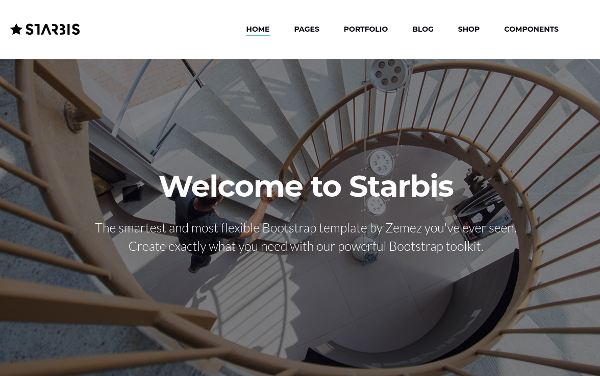
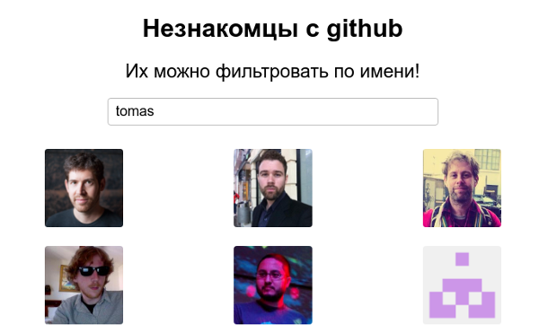

### Задание 2

Задание предполагает изучение раздела "Основные понятия" с сайта https://ru.reactjs.org, в основном пункты 5,6,7
Так же изучение роутера https://reach.tech/router раздел Tutorial пункты Router, Url Parameters

Создать React приложение из 3 страниц с помощью роутера 

Нужно воспрользоваться  `<Router/>` `<Page1 path="/page1" />` `<Link to="/page1" />`

На главной `"/"` сделать меню с логотипом, картинку и лозунгом 'джумботрон'
  

Обратить внимание:
- Активная ссылка выделена, всего 3 ссылки  
- Логотип слева, можно просто текстовый  
- Меню справо  
- Лозунг по центру крупнее, жирнее
- Текст под лозунгом попробовать сделать тонким
- Пока все делать с расчетом на фиксированную ширину экрана ~1200px

На второй `"/counter"` сделать бесконечный счетчик, используя setInterval, без цикла
с периодом 1000мс  
Выводить текущее значение на экран, например `
300
`  
Когда счетчик превысит пороговое значение Х вывести под ним текст `
Счетчик больше Х
`  
Сделать кнопку сброса счетчика на ноль.  

Обратить внимание:  
- Прочитать про жизненный цикл (ЖЦ) компонента, можно на каждом этапе выводить в консоль текст с именем этапа ЖЦ
- Создавать счетчик в "монтаже" компонента, удать при "демонтаже"
- Попробовать не удалять, посмотреть какой будет эффект 
- Предусмотреть, что сброс может быть после того, как появился текст "Счетчик больше Х"

На третьей странице `"/users"` вывести на экран пользователей гитхаба из файла `users.js`  
Сделать возможность использования параметра, вписываемого пока в ручную `"/users?id=37"`  
Прочитать параметр из URL средствами reach-router и использовать для фильтрации списка по точному совпадению с идентификатором пользователя (поле id)  
Сделать `<input type="text">` и использовать текст из инпута для фильтрации списка по частичному совпадению с логином пользователя (поле login)  

Обратить внимание:  
- Аватары большие, при выводе на страницу сделать поменьше средствами css 
- Попробовать выводить по 3 картинки в один ряд и не подгоном ширины под автоперенос, а поискать способы как это делать "надежно".
- Прочитать как управлять элементами типа input (при изменении текста используется state)
- При вводе каждой\следующей буквы в input список пользователей будет сразу меняться, чтобы удовлетворять фильтру
- Можно поменять в списке пользователей текст в поле login, чтобы фильтр интересней работал 
